# Garden Layout

**Location:** Vancouver, BC (Zone 8b, ~49°N latitude)
**Last updated:** March 2026

---

## Orientation

| Direction | Feature |
|-----------|---------|
| **North** | Back of property (shed) |
| **South** | Front of property (street) — open sky |
| **East**  | Right side of property |
| **West**  | Left side of property (fenced) |

---

## Beds Overview

| Name | Area | Sun Exposure | Notes |
|------|------|--------------|-------|
| [BY-Shed](#by-shed) | 10 × 4 ft | Part shade, ~3–4 hrs | Between shed (N) and house (S), west fence |
| [BY-Back](#by-back) | 4 × 15 ft | Part–full sun, ~4–6 hrs | East border, north section, morning sun |
| [BY-Front](#by-front) | 4 × 15 ft | Mostly shade, ~2–3 hrs | East border, south section, tree shadow PM |
| [BY-WestFence](#by-westfence) | 1 × ~20 ft | Part shade | Along west fence, **NON-FOOD** garden |
| [FY-Square](#fy-square) | 15 × 8 ft | Full sun, 6–8+ hrs | Front yard, south-facing, open sky |
| [FY-Triangle](#fy-triangle) | ~60 sq ft | Full sun, 6–8+ hrs | Front yard, south-facing, triangular shape |

---

## Bed Details

### BY-Shed
*Backyard, beside shed*

- **Size:** 10 × 4 ft (40 sq ft)
- **Sun:** Part shade, ~3–4 hrs (midsummer estimate)
- **Obstructions:** House to south, shed to north, 6 ft west fence
- **Notes:** Shed is single-storey (~10–12 ft). Garage originally noted — confirmed to be a shed.

---

### BY-Back
*Backyard, east border, north half*

- **Size:** 4 × 15 ft (60 sq ft)
- **Sun:** Part–full sun, ~4–6 hrs (midsummer estimate)
- **Obstructions:** Shed to north (low impact — sun comes from south)
- **Notes:** Morning sun, east-facing. Previously labelled Bed 2 north.

---

### BY-Front
*Backyard, east border, south half*

- **Size:** 4 × 15 ft (60 sq ft)
- **Sun:** Mostly shade, ~2–3 hrs (midsummer estimate)
- **Obstructions:** Pear tree casts significant evening shadow across this bed
- **Notes:** Previously labelled Bed 2 south. Same physical border as BY-Back but treated as separate bed.

---

### BY-WestFence
*Backyard, west fence strip*

- **Size:** 1 × ~20 ft (~20 sq ft)
- **Sun:** Part shade (6 ft fence to west)
- **Obstructions:** 6 ft west fence
- **Notes:** **NON-FOOD garden.** Runs full length of west fence, stopping at BY-Shed to the north.

---

### FY-Square
*Front yard, left bed*

- **Size:** 15 × 8 ft (120 sq ft)
- **Sun:** Full sun, 6–8+ hrs (midsummer estimate)
- **Obstructions:** None significant. 4 ft west fence casts minimal shadow.
- **Notes:** Best growing conditions on the property.

---

### FY-Triangle
*Front yard, right bed*

- **Size:** ~60 sq ft (triangular, approx 15 × 8 ft footprint)
- **Sun:** Full sun, 6–8+ hrs (midsummer estimate)
- **Obstructions:** None significant
- **Notes:** Triangular shape reduces usable area vs FY-Square. Best growing conditions on the property.

---

## Notable Features

### Pear Tree
- **Location:** Backyard, centre-west area
- **Height:** 30–40 ft (estimated)
- **Type:** Deciduous
- **Shadow impact:** Casts significant evening shadow eastward across BY-Front (south half of east border bed)

### West Fence (Backyard)
- **Height:** 6 ft
- **Impact:** Shades BY-Shed and BY-WestFence; minimal impact on other beds

### West Fence (Front Yard)
- **Height:** 4 ft
- **Impact:** Minimal shadow impact on FY-Square

---

## Sun Exposure Notes

- All hour estimates are for **midsummer (June/July)** peak conditions. Hours will be lower in spring/fall and significantly lower in winter.
- Vancouver's sun angle (~49°N) means all meaningful sun comes from the **southern half of the sky**. North-facing obstructions have minimal impact; south-facing obstructions are the main constraint.
- Sun hours were estimated through reasoning about obstructions and orientation, not measured. Recommend verifying with [SunCalc.org](https://www.suncalc.org) or the Sun Surveyor app for precision.

---

## Total Food Growing Area

| Bed | Area | Sun |
|-----|------|-----|
| BY-Shed | 40 sq ft | Part shade |
| BY-Back | 60 sq ft | Part–full sun |
| BY-Front | 60 sq ft | Mostly shade |
| FY-Square | 120 sq ft | Full sun |
| FY-Triangle | 60 sq ft | Full sun |
| **Total** | **340 sq ft** | |
