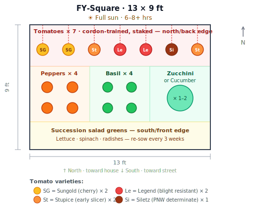
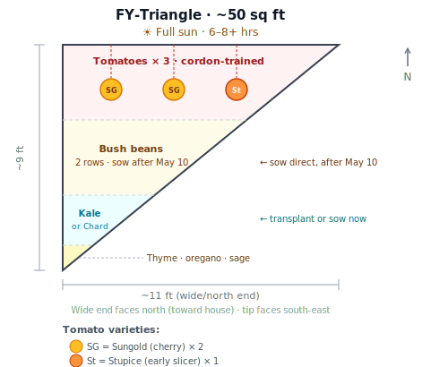
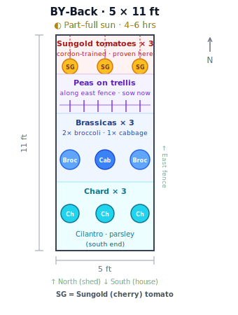
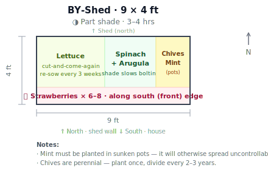
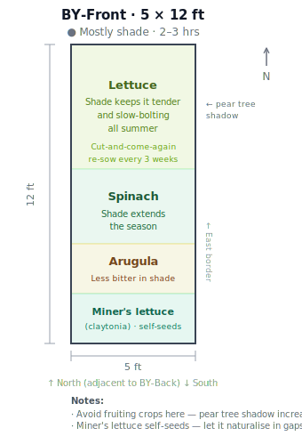

# 2026 Growing Plan

**Garden:** Vancouver, BC · Zone 8b  
**Updated:** April 2026  
**Total food growing area:** ~318 sq ft

---

## Overview

| Bed | Size | Sun | Main Crops | Tomatoes |
|-----|------|-----|-----------|---------|
| [FY-Square](#fy-square) | 13 × 9 ft | Full sun · 6–8+ hrs | Tomatoes, peppers, basil, zucchini, greens | 7 |
| [FY-Triangle](#fy-triangle) | ~50 sq ft | Full sun · 6–8+ hrs | Tomatoes, beans, kale/chard, herbs | 3 |
| [BY-Back](#by-back) | 5 × 11 ft | Part–full sun · 4–6 hrs | Sungold tomatoes, peas, brassicas, chard | 3 |
| [BY-Shed](#by-shed) | 9 × 4 ft | Part shade · 3–4 hrs | Lettuce, spinach, arugula, strawberries, herbs | — |
| [BY-Front](#by-front) | 5 × 12 ft | Mostly shade · 2–3 hrs | Lettuce, spinach, arugula, miner's lettuce | — |
| BY-WestFence | 1 × ~20 ft | Part shade | Non-food ornamentals | — |
| **Total** | **~318 sq ft** | | | **13 plants** |

---

## Tomato Plan

13 plants total · All grown as **single-stem cordons** (pinch all suckers weekly, single stake)

| Bed | Plants | Varieties |
|-----|--------|-----------|
| FY-Square | 7 | 2× Sungold · 2× Stupice · 2× Legend · 1× Siletz |
| FY-Triangle | 3 | 2× Sungold · 1× Stupice |
| BY-Back | 3 | 3× Sungold *(proven performer in this bed)* |
| **Total** | **13** | 7× Sungold · 3× Stupice · 2× Legend · 1× Siletz |

**Start indoors now** (early April) — tomatoes need 6–8 weeks before transplanting in mid-May.

---

## April Action List

| Task | Priority |
|------|---------|
| Start tomato seeds indoors | 🔴 Do now |
| Start pepper seeds indoors | 🔴 Do now |
| Direct sow peas in BY-Back | 🔴 Do now |
| Direct sow lettuce, spinach, arugula in shade beds | 🟡 This week |
| Transplant or sow kale/chard in FY-Triangle & BY-Back | 🟡 This week |
| Source brassica starts from nursery | 🟡 This week |
| Plant perennial herbs (thyme, oregano, sage, chives) | 🟢 Anytime in April |
| Set up trellis in BY-Back for peas | 🟢 Before peas need it (~3 weeks) |
| Start cucumber/zucchini seeds indoors | 🟢 Late April |

---

## Bed Plans

### FY-Square

*13 × 9 ft · Full Sun · 6–8+ hrs*

| Zone | Crop | Notes |
|------|------|-------|
| North edge | Tomatoes × 7 (cordon-staked) | 2× Sungold · 2× Stupice · 2× Legend · 1× Siletz |
| Middle left | Peppers × 4 | Sweet or hot — your choice |
| Middle centre | Basil × 4 | Companion to tomatoes |
| Middle right | Zucchini or cucumber × 1–2 | Start indoors late April |
| South edge | Succession salad greens | Lettuce · spinach · radishes — re-sow every 3 weeks |

---

### FY-Triangle

*~50 sq ft · Full Sun · 6–8+ hrs*

| Zone | Crop | Notes |
|------|------|-------|
| Wide end (north) | Tomatoes × 3 (cordon-staked) | 2× Sungold · 1× Stupice |
| Middle | Bush beans | 2 short rows — direct sow after May 10 |
| Narrowing section | Kale or chard × 3–4 | Transplant now or direct sow |
| Tip & edges | Perennial herbs | Thyme · oregano · sage — plant once, harvest for years |

---

### BY-Back

*5 × 11 ft · Part–Full Sun · 4–6 hrs*

| Zone | Crop | Notes |
|------|------|-------|
| North end | Sungold tomatoes × 3 (cordon-staked) | Proven performers in this bed |
| Upper middle | Climbing peas on trellis | Along east fence — sow now |
| Middle | Brassicas × 3 | 2× broccoli · 1× cabbage |
| South end | Chard × 3 + cilantro/parsley | Chard 'Bright Lights' or similar |

---

### BY-Shed

*9 × 4 ft · Part Shade · 3–4 hrs*

| Zone | Crop | Notes |
|------|------|-------|
| Left section | Lettuce | Cut-and-come-again — re-sow every 3 weeks |
| Centre | Spinach + arugula | Shade slows bolting — extended harvest |
| Right section | Chives + mint | Chives perennial; mint in sunken pots (containment!) |
| Front edge | Strawberries × 6–8 | Along south edge; tolerate part shade |

---

### BY-Front

*5 × 12 ft · Mostly Shade · 2–3 hrs*

| Zone | Crop | Notes |
|------|------|-------|
| North half | Lettuce | Shade keeps it tender and slow-bolting all summer |
| Centre | Spinach | |
| Lower centre | Arugula | |
| Edges & gaps | Miner's lettuce (claytonia) | Native PNW green; self-seeds freely, thrives in shade |

---

### BY-WestFence

*1 × ~20 ft · Part Shade · Non-Food*

Ornamental climbers along the 6 ft west fence. Good options for part shade:
- **Clematis** — many varieties suited to 3–4 hrs sun
- **Climbing nasturtiums** — edible flowers if plans change
- **Climbing rose** — sheltered by fence, manageable in part shade

---

## Growing Notes

**Cordon training:** Pinch out all side shoots (suckers) every week once plants are established. Tie the single main stem to a 6–7 ft stake every 20–30 cm as it grows. This is what makes fitting 13 plants in the available space workable.

**Succession sowing:** For lettuce, radishes, and cilantro — sow a short row every 2–3 weeks rather than one large sowing. Continuous harvest instead of a glut.

**Blight prevention:** Vancouver's cool, damp summers make late blight (*Phytophthora infestans*) a real risk. Prefer resistant varieties (Legend), ensure good airflow between plants, water at the base only, and remove any infected foliage immediately.

**Pear tree:** Fully leafed out by May — shading in BY-Front will increase through summer. The shade-tolerant planting there is deliberate and will benefit from it.

**Sun estimates:** All sun hour figures are midsummer peak. Verify with [SunCalc.org](https://www.suncalc.org) or the Sun Surveyor app for precision.
